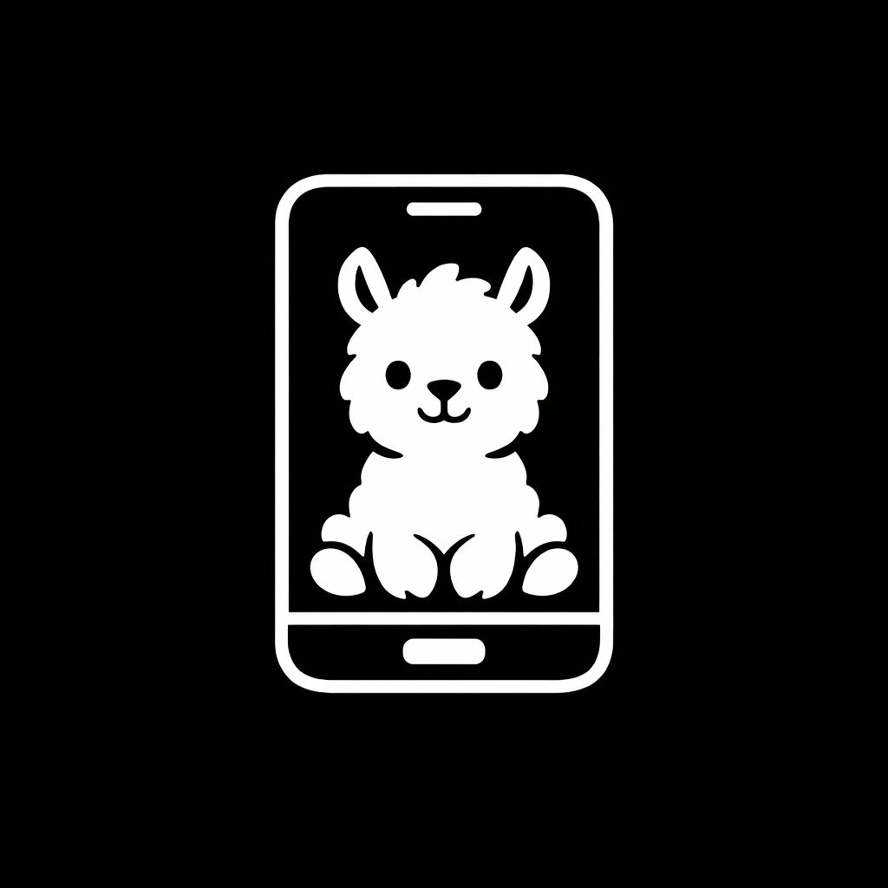

<div align="center">



# PocketLlama

**Chat with your local Ollama models from anywhere — right from your phone.**

[](LICENSE)
[](#server-setup)
[](#mobile-app-setup)
[](#installation)

PocketLlama turns your PC into a private AI server. Run the server script, scan the QR code with your phone, and start chatting — with streaming responses, vision model support, conversation branching, and more.

</div>

---

## How It Works

```
┌─────────────┐         ┌──────────────────┐         ┌──────────┐
│  📱 Phone    │ ──────▶ │  🌐 DevTunnel     │ ──────▶ │  🦙 Ollama │
│  PocketLlama │ ◀────── │  (authenticated   │ ◀────── │  (local)   │
│  App         │         │   Python proxy)   │         │            │
└─────────────┘         └──────────────────┘         └──────────┘
       │                        │
       │    QR Code / Manual    │
       │◀───────────────────────│
       │   {url, key} JSON      │
```

1. **Run the server** on your PC → it starts Ollama, creates a secure tunnel, and shows a QR code
2. **Scan the QR** with the PocketLlama app → instantly connected
3. **Pick a model** and start chatting — responses stream in real-time

---

## Features

### Chat
- 💬 **Streaming responses** — token-by-token, just like ChatGPT
- 🧠 **Thinking model support** — `<think>` tags shown in a collapsible "Thought Process" section
- 🌿 **Conversation branching** — edit a message to create branches, navigate with `< 1/2 >` arrows (like ChatGPT)
- 🔄 **Retry responses** — regenerate any assistant response as a new branch
- ✏️ **Edit messages** — modify sent messages with full image re-attachment
- 📋 **Copy messages** — one-tap copy to clipboard
- 📝 **Auto-generated titles** — the LLM names your chats after the first exchange
- 🗑️ **Chat management** — rename, delete, organized by date in a side drawer

### Media
- 📷 **Vision model support** — attach images from camera or gallery (auto-detected via `/api/show`)
- 🔍 **Full-screen image viewer** — tap any image to view at full size
- 🎤 **Voice input (STT)** — optional speech-to-text via faster-whisper (server-side)

### Connection
- 📱 **QR code scanning** — instant connection, no typing
- 🔑 **Secure auth** — random key generated on each server start, validated on every request
- 💾 **Saved connections** — quickly reconnect to previous servers
- 🌐 **DevTunnels** — secure public access to your local Ollama, no port forwarding needed

### Storage
- 🗄️ **Local SQLite** — all chats stored on-device, no cloud, fully private
- 🌿 **Branch-aware storage** — full conversation tree persisted, switch branches anytime

---

## Installation

### Prerequisites

- [Ollama](https://ollama.com) installed with at least one model pulled
- [DevTunnel CLI](https://learn.microsoft.com/en-us/azure/developer/dev-tunnels/get-started) installed and logged in
- Python 3.11+ (for the server)

### Server Setup

```bash
cd server

# Create virtual environment
python -m venv .venv

# Activate it
.venv\Scripts\activate        # Windows
source .venv/bin/activate     # Linux/Mac

# Install dependencies
pip install -r requirements.txt

# Copy config template
cp .env.example .env

# Start the server
python start.py
```

The server will:
1. Auto-start Ollama if not running
2. Generate a random auth key
3. Start a DevTunnel with public access
4. Display a QR code + connection details in the terminal

### Mobile App Setup

**Option A — Install the APK** (Android)

Download the latest APK from the `mobile/dist/` folder and install it on your phone.

**Option B — Development with Expo Go**

```bash
cd mobile
npm install
npx expo start
```

Scan the Expo QR code with the Expo Go app on your phone.

**Option C — Build your own APK**

```bash
cd mobile
npm install -g eas-cli
eas login
eas build --platform android --profile preview
```

---

## Configuration

### Server `.env`

| Variable | Default | Description |
|----------|---------|-------------|
| `PROXY_PORT` | `8080` | Port the proxy server listens on |
| `OLLAMA_PORT` | `11434` | Port Ollama is running on |
| `ENABLE_STT` | `false` | Enable speech-to-text endpoint |
| `WHISPER_MODEL` | `small` | Whisper model size: `tiny`, `base`, `small`, `medium`, `large` |

### Enabling Speech-to-Text

```bash
# Install faster-whisper
pip install faster-whisper

# Edit .env
ENABLE_STT=true
WHISPER_MODEL=small    # Use 'tiny' for faster but less accurate

# Restart the server
python start.py
```

When STT is enabled, a microphone button appears in the chat input. Tap to record, tap again to stop — the audio is sent to the server for transcription and the text is appended to your message.

---

## Architecture

```
server/
├── start.py              # Entry point — startup orchestration
├── app.py                # FastAPI — proxy, auth, /health, /stt
├── config.py             # .env loader
└── Start-PocketLlama.ps1 # Legacy PowerShell server

mobile/
├── app/                  # Screens (expo-router)
│   ├── index.tsx         # Connection (QR scan / manual)
│   ├── models.tsx        # Model selection
│   └── (chat)/[id].tsx   # Chat interface
├── components/           # UI components
├── services/             # API client, database, connection
├── contexts/             # Global state (React Context)
├── types/                # TypeScript interfaces
└── constants/            # Theme tokens
```

### Tech Stack

| Layer | Technology |
|-------|-----------|
| **Server** | Python, FastAPI, httpx, uvicorn |
| **Tunnel** | Azure DevTunnels |
| **LLM** | Ollama (local) |
| **Mobile** | React Native, Expo SDK 54, TypeScript |
| **Navigation** | expo-router, @react-navigation/drawer |
| **Storage** | expo-sqlite |
| **Streaming** | XMLHttpRequest + NDJSON parsing |
| **STT** | faster-whisper (optional) |
| **Auth** | Random hex key + X-Auth-Key header |

---

## Legacy PowerShell Server

The original server was a PowerShell script (`server/Start-PocketLlama.ps1`). It still works and can be used as an alternative if Python isn't available:

```powershell
cd server
.\Start-PocketLlama.ps1
```

Note: The PowerShell server does not support STT.

---

## Troubleshooting

### "Connection Failed" when scanning QR
- Ensure the server terminal shows the DevTunnel URL
- Test from your PC: `curl.exe -H "X-Auth-Key: <key>" <url>/api/tags`
- Make sure DevTunnel CLI is logged in: `devtunnel user login`

### Streaming not working (all text appears at once)
- This was fixed by using XMLHttpRequest instead of fetch (Hermes doesn't support ReadableStream)
- Make sure you're on the latest code

### No models found
- Pull a model first: `ollama pull llama3.1`
- Check Ollama is running: `ollama list`

### STT mic button not showing
- Check `/health` returns `"stt": true`
- Ensure `ENABLE_STT=true` in `.env` and `faster-whisper` is installed

---

## Contributing

Contributions are welcome! Feel free to:

- 🐛 Report bugs by opening an issue
- 💡 Suggest features
- 🔀 Submit pull requests
- 📖 Improve documentation

### Development Setup

1. Fork the repository
2. Create a feature branch: `git checkout -b feature/my-feature`
3. Make your changes
4. Run TypeScript check: `cd mobile && npx tsc --noEmit`
5. Test on a device with Expo Go
6. Submit a pull request

---

## Author

**Varun Patkar** — [github.com/Varun-Patkar](https://github.com/Varun-Patkar)

---

## License

[MIT](LICENSE)

---

<div align="center">

Made with ❤️ for the local AI community

*Your AI, your data, your phone.*

</div>

---

## Demo

<!-- Add demo video/GIF here -->
<!-- Example: -->
<!-- https://github.com/user-attachments/assets/your-video-id -->

> 📹 *Demo video coming soon*
